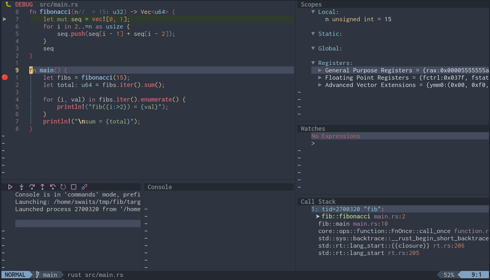

# turbo-debug.nvim

A zero-config debugging experience for Neovim 0.12+. One plugin install, full
IDE-class debugging: inline variable values, hover inspection, persistent
breakpoints, watch expressions, and modal keybindings that just work.

Inspired by Turbo Pascal — the first IDE where you could just hit a key
and start debugging.



## Install

```lua
vim.pack.add("swaits/turbo-debug")
```

That's it. No other config needed. See `:help turbo-debug` for customization.

## How It Works

turbo-debug is **modal**. Press `<leader>dd` and you enter debug mode — the
dap-ui layout opens, keybindings activate, virtual text lights up, and
you're debugging. Press `<leader>dd` again (or `q`) and everything
disappears: the session terminates, the UI closes, and every keybinding is
restored to exactly what it was.

This modal approach is inspired by
[debugmaster.nvim](https://github.com/MironPascalCaseFan/debugmaster.nvim).
During a debug session you **navigate** code and **inspect** state; you
don't **edit**. So debug mode shadows editing keys (`c`, `d`, `s`, `r`,
`x`) with debug actions and leaves all navigation keys untouched (`h`,
`j`, `k`, `l`, `w`, `b`, `e`, `f`, `/`, `n`, etc.).

### A nice text *and* GUI debugger

The modal keymap is deliberately **left-hand optimized** so the right hand
stays on the mouse for interacting with the dap-ui panes:

- **Left hand on keyboard**: `c s d r C x X D W E q R` fire the twelve
  rapid-use debug actions without leaving home row.
- **Right hand on mouse**: click into Watches/Scopes/Stacks/Breakpoints
  panes to expand trees, jump to frames, add watch expressions, or toggle
  breakpoints from the GUI.

Only two modal keys live on the right hand, both by universal convention:
`K` for hover (matches the LSP hover key) and `?` for help.

Inside dap-ui panes, the native dap-ui mappings still work — `d` removes a
watch, `r` sends to REPL, `e` edits. The modal `d` (step-into) and `r`
(step-out) yield to dap-ui in those buffers so you can manage the GUI
without exiting debug mode.

## Keybindings

Everything lives under `<leader>d` (with
[which-key](https://github.com/folke/which-key.nvim) support if installed):

| Key | Action |
|-----|--------|
| `<leader>dd` | Toggle debug mode |
| `<leader>dx` | Toggle breakpoint |
| `<leader>dX` | Conditional breakpoint |
| `<leader>dD` | Clear all breakpoints |

During debug mode, single-key controls:

| Key | Action | Key | Action |
|-----|--------|-----|--------|
| `c` | Continue | `x` | Toggle breakpoint |
| `s` | Step over | `X` | Conditional breakpoint |
| `d` | Step into | `D` | Clear all breakpoints |
| `r` | Step out | `W` | Watch expression |
| `C` | Run to cursor | `K` | Hover / inspect |
| `q` | Terminate session | `E` | Eval in REPL |
| `R` | Restart session | `?` | Help popup |

Press `?` during debug mode for a quick reference that also lists dap-ui's
native in-pane bindings (`<CR>`, `e`, `o`, `d`, `r`, `t`).

### Extending keymaps

Every key is user-overridable. Remap, disable, or add bindings via
`setup()`:

```lua
require("turbo-debug").setup({
  keys = {
    step_over = "n",   -- remap a modal key
    watch = false,     -- disable a modal key
  },
  global_keys = {
    toggle = "<leader>D",   -- change the toggle chord
  },
  sidebar = "right",        -- "left" (default) or "right"
  help_on_enter = false,    -- disable the help splash
  quit_exits_mode = false,  -- q terminates but stays in debug mode
})
```

### Statusline integration

If you want a live debug indicator in your statusline, add
`require("dap").status()` as a lualine/heirline component — it returns a
progress message while debugging and an empty string when idle.

## Supported Languages

turbo-debug ships adapter configs for 12 languages. You install the adapter
binary (via [mason.nvim](https://github.com/williamboman/mason.nvim), your
package manager, or manually) — turbo-debug handles all the configuration.

| Language | Adapter | Language | Adapter |
|----------|---------|----------|---------|
| Python | debugpy | C# | netcoredbg |
| JavaScript / TS | js-debug | Java | java-debug-adapter |
| Go | delve | Kotlin | kotlin-debug |
| C / C++ | codelldb | PHP | php-debug |
| Rust | codelldb | Ruby | rdbg |
| Swift | codelldb | Lua (Neovim) | osv |

Rust gets special treatment: pressing `c` runs `cargo build` automatically
and picks the binary via `vim.ui.select`.

## What This Plugin Actually Does

turbo-debug is **glue**. It does not implement a debugger, a UI framework,
virtual text rendering, or breakpoint persistence. It configures and wires
together these excellent plugins into a single cohesive experience:

| Plugin | What it provides |
|--------|-----------------|
| [nvim-dap](https://github.com/mfussenegger/nvim-dap) | DAP client — the core debug engine |
| [nvim-dap-ui](https://github.com/rcarriga/nvim-dap-ui) | Scopes, stacks, watches, REPL, console UI |
| [nvim-nio](https://github.com/nvim-neotest/nvim-nio) | Async IO (required by nvim-dap-ui) |
| [nvim-dap-virtual-text](https://github.com/theHamsta/nvim-dap-virtual-text) | Inline variable values in source code |
| [persistent-breakpoints.nvim](https://github.com/Weissle/persistent-breakpoints.nvim) | Breakpoints that survive restarts |

All five are loaded automatically via `vim.pack.add`. You never declare them.

Adapter configurations are inlined from the work of these projects (no
runtime dependency, we just studied their configs and wrote plain Lua tables):

- [nvim-dap-python](https://github.com/mfussenegger/nvim-dap-python)
- [nvim-dap-go](https://github.com/leoluz/nvim-dap-go)
- [nvim-dap-vscode-js](https://github.com/mxsdev/nvim-dap-vscode-js)
- [nvim-dap-lldb](https://github.com/julianolf/nvim-dap-lldb)
- [nvim-dap-cs](https://github.com/NicholasMata/nvim-dap-cs)
- [nvim-dap-ruby](https://github.com/suketa/nvim-dap-ruby)
- [nvim-dap-kotlin](https://github.com/Mgenuit/nvim-dap-kotlin)

## License

MIT
